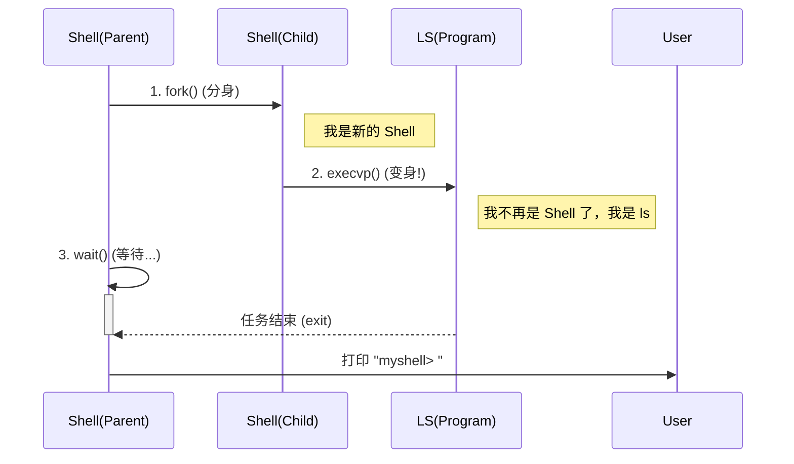

# 🧬 深入理解 Linux 进程：分身与夺舍

在写 Shell 的过程中，我们接触了操作系统最“魔法”的三个函数：`fork`, `exec`, `wait`。
如果不理解它们，Unix 系统对你来说就是一个黑盒。

让我们用**“克隆人”**的比喻来彻底通过这一关。

---

## 1. 什么是进程 (Process)？
想象一个进程就是一个**正在干活的工人**。
*   他有自己的**身份证** (PID)。
*   他有自己的**工作台** (内存空间/变量)。
*   他有自己的**工具箱** (文件描述符)。

---

## 2. Fork：影分身之术 (The Clone)

`fork()` 是 Unix 世界最奇特的设定：**它不产生新东西，它只复制自己。**

*   **操作**：Shell 调用 `fork()`。
*   **结果**：瞬间，世界上多了一个一模一样的 Shell（子进程）。
    *   代码一模一样。
    *   变量一模一样。
    *   连刚才执行到了哪一行都一模一样。
*   **唯一的区别**：
    *   父进程收到的返回值是 **子进程的 ID** (因为它是家长，得知道孩子叫啥)。
    *   子进程收到的返回值是 **0** (因为它刚出生，还没名字)。

```c
pid_t pid = fork();
if (pid == 0) {
    // 我是克隆人 (子进程)
} else {
    // 我是本体 (父进程)
}
```

---

## 3. Exec：灵魂夺舍 (The Transformation)

如果子进程永远和父进程一样，那就没意义了。
我们生出子进程，是为了让它去干别的活（比如运行 `ls`）。

这就是 `execvp()` 的作用：**脑移植**。

*   **操作**：子进程调用 `execvp("ls", args)`。
*   **结果**：
    1.  操作系统清空子进程的大脑（内存）。
    2.  操作系统把 `ls` 程序的代码加载进来。
    3.  **从这一刻起，子进程就不再是 Shell 了，它变成了 ls。**
*   **注意**：`exec` 如果成功，代码就**永远不会**返回了（因为原来的脑子已经被丢掉了）。

---

## 4. Wait：望子成龙 (The Parent)

父进程（Shell）生了孩子（Fork），孩子也变身去干活了（Exec）。
这时候父进程该干嘛？
答：**等 (Block)**。

如果不等，父进程就会立刻打印下一个 `myshell> ` 提示符。结果就是：
*   屏幕上 `ls` 的输出和 Shell 的提示符混在一起，乱套了。
*   或者子进程变成了“僵尸进程” (Zombie)。

`waitpid()` 就是让父进程搬个小板凳坐在那，直到收到通知：“你的孩子 `ls` 干完活退出了”。

---

## 总结图示


